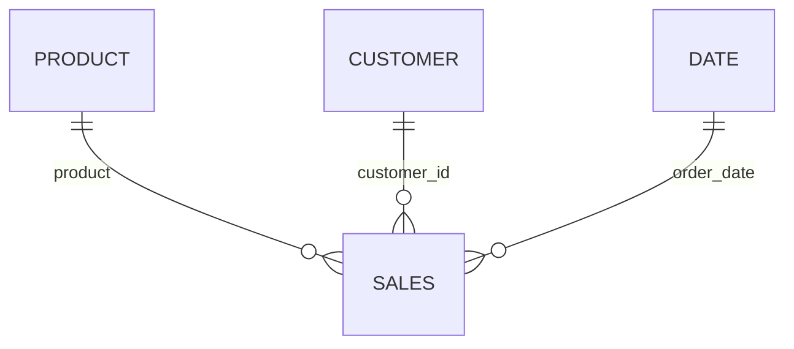

# Power BI retail profitability report

A Power BI project with an editable semantic model, DAX measures and five data-bound visuals for exploring revenue, margin, products and regions.

## Open the report

1. Download the complete repository ZIP and extract all files together.
2. Use a recent Power BI Desktop release supporting PBIP and the enhanced PBIR report format. Enable the relevant project/report preview features if your version requires them.
3. Open **Profitability.pbip**.
4. Select **Refresh** to load the embedded sample data. The first open has model definitions but no committed local data cache.
5. Confirm $1,179,262.25 net revenue, $356,734.25 gross profit, 30.25% margin (30.3% at one decimal), and 1,800 orders with all filters cleared.
6. Select bars to explore cross-filtering. Use the Filters pane for year, category, region or channel. Save your refreshed copy locally.

The sample data is embedded as compressed JSON in a Power Query expression. It contains no credentials or private records and does not depend on a local file path. The CSV copy is included for inspection. Replacing the data requires updating the SampleRows expression and preserving the expected columns and types.

## Model and report

The model uses single-direction dimension-to-fact relationships. Product and Customer keys are deduplicated. Date contains every day from January 2024 through December 2025.

The report includes a KPI strip, monthly revenue/profit trend, category margin comparison, product profit chart and regional revenue chart. `measures.dax` makes all nine DAX measures easy to review. The actual measures are also defined in `Profitability.SemanticModel/model.bim`.

## Business interpretation

Furniture leads revenue but has a lower gross margin than Technology and Office Supplies. Use the product view to investigate whether discount policy or cost structure drives this difference. No real financial impact or causal effect is claimed.

## Validation status

The report definition passes Microsoft's authoring validator with zero errors and zero warnings. Source-data totals and model bindings have been checked. Desktop refresh, DAX results and the rendered report still await validation.

## References

- [Power BI projects](https://learn.microsoft.com/en-us/power-bi/developer/projects/projects-overview)
- [Semantic model project format](https://learn.microsoft.com/en-us/power-bi/developer/projects/projects-dataset)
- [Report definition format](https://learn.microsoft.com/en-us/rest/api/fabric/articles/item-management/definitions/report-definition)

## Dataset and definitions

This is a synthetic learning project, not client work or evidence of real business impact. It uses seed 42 to generate 1,800 orders, 3,538 order lines, 200 customer records and six products across 2024–2025. All monetary figures are USD. Customer names are fictional placeholders. Order dates and purchase choices are randomized. These results describe this sample only.

- **Grain:** one order line. Order count uses distinct order IDs.
- **Net revenue:** quantity × unit price, less line discount, with returned lines set to zero.
- **Gross profit:** net revenue less retained-product cost. Returned lines reverse both revenue and cost, assuming full cost recovery.
- **Gross margin:** total gross profit / total net revenue. It is not the average of line margins.
- **Return rate:** returned lines / all lines, not returned orders / all orders.
- Excludes taxes, delivery fees, overhead, return handling and damaged inventory.

## Control totals

| Metric | Value |
|---|---:|
| Net revenue | $1,179,262.25 |
| Gross profit | $356,734.25 |
| Gross margin | 30.2506% |
| Distinct orders | 1,800 |
| Order lines | 3,538 |
| Returned lines | 186 |
| Loss-making lines | 61 |

## One case study, three tools

These three projects use the same fictional retail dataset to show different tools. Each repository can be explored independently.

- [SQL: customer and sales analysis](https://github.com/ashikiqbal-work/sql-retail-analysis)
- [Excel: sales dashboard](https://github.com/ashikiqbal-work/excel-sales-dashboard)
- [Power BI: profitability report](https://github.com/ashikiqbal-work/powerbi-profitability-report)
